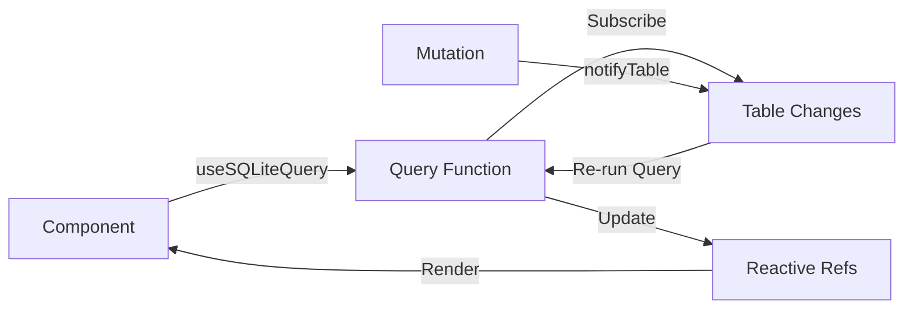

The `@alexop/sqlite-vue` package provides seamless Vue 3 integration with reactive composables and a plugin system.

## Features

- **Dependency Injection** - Access the database client anywhere in your component tree
- **Reactive Queries** - Automatically re-run queries when data changes
- **Composables** - Vue-friendly API with `useSQLiteQuery()` and `useSQLiteClientAsync()`
- **Type Safety** - Full TypeScript support with schema inference
- **Auto-Subscribe** - Automatic subscription to table changes

## Quick Example

```vue
<script setup lang="ts">
import { ref } from "vue";
import { useSQLiteQuery, useSQLiteClientAsync } from "@alexop/sqlite-vue";

// Get reactive query results
const {
  rows: todos,
  loading,
  error,
  refresh,
} = useSQLiteQuery(
  (db) => db.query("todos").orderBy("createdAt", "DESC").all(),
  { tables: ["todos"] }
);

// Get client for mutations
const dbPromise = useSQLiteClientAsync();
const newTitle = ref("");

async function addTodo() {
  const db = await dbPromise;
  await db.insert("todos").values({
    id: crypto.randomUUID(),
    title: newTitle.value,
  });
  db.notifyTable("todos"); // Triggers reactive update
  newTitle.value = "";
}
</script>

<template>
  <div>
    <input v-model="newTitle" @keyup.enter="addTodo" />
    <button @click="addTodo">Add Todo</button>

    <div v-if="loading">Loading...</div>
    <div v-else-if="error">Error: {{ error.message }}</div>
    <ul v-else>
      <li v-for="todo in todos" :key="todo.id">
        {{ todo.title }}
      </li>
    </ul>
  </div>
</template>
```

## Architecture

### Plugin System

The plugin installs the SQLite client via Vue's dependency injection:

```typescript
// main.ts
import { createApp } from 'vue';
import { createSQLite } from '@alexop/sqlite-vue';
import App from './App.vue';

const app = createApp(App);

app.use(createSQLite({
  schema: dbSchema,
  filename: "file:app.sqlite3?vfs=opfs",
  migrations: [...]
}));

app.mount('#app');
```

The plugin provides a `Promise<SQLiteClient>` that resolves after initialization.

### Composables

Two main composables:

1. **`useSQLiteClientAsync()`** - Returns the client promise for mutations
2. **`useSQLiteQuery()`** - Returns reactive query results

Both use Vue's `inject()` under the hood and must be called during component setup.

### Reactivity Flow



1. Component calls `useSQLiteQuery()` with a query function
2. Query executes and subscribes to specified tables
3. Mutation calls `db.notifyTable(table)`
4. Subscribers re-run their queries
5. Reactive refs update automatically
6. Component re-renders

## Critical Pattern: inject() Timing

Vue's `inject()` must be called during component setup, NOT inside async functions:

```typescript
// ❌ WRONG - inject() called inside async function
async function addTodo() {
  const db = await useSQLiteClientAsync(); // Error!
  await db.insert("todos").values({ ... });
}

// ✅ CORRECT - inject() called during setup
const dbPromise = useSQLiteClientAsync();

async function addTodo() {
  const db = await dbPromise; // Await the stored promise
  await db.insert("todos").values({ ... });
}
```

This is a Vue limitation, not a SQLite Web issue. See [Vue's inject() docs](https://vuejs.org/api/composition-api-dependency-injection.html#inject) for details.

## When to Use Which Package

| Scenario             | Package                      |
| -------------------- | ---------------------------- |
| Vue 3 application    | `@alexop/sqlite-vue`         |
| React/Angular/Svelte | `@alexop/sqlite-core`        |
| Node.js backend      | Not supported (browser-only) |
| Vanilla JavaScript   | `@alexop/sqlite-core`        |

## Benefits Over Core Package

Using the Vue package gives you:

- Automatic reactivity via `useSQLiteQuery()`
- Dependency injection for clean architecture
- Loading/error states out of the box
- Auto-subscription to table changes
- Vue-friendly API design

If you're building a Vue app, always use `@alexop/sqlite-vue`.

## Next Steps

- [Plugin Setup](/vue/plugin/) - Configure the Vue plugin
- [Composables](/vue/composables/) - Learn the composable APIs
- [Reactive Queries](/vue/reactive-queries/) - Master reactive data fetching
